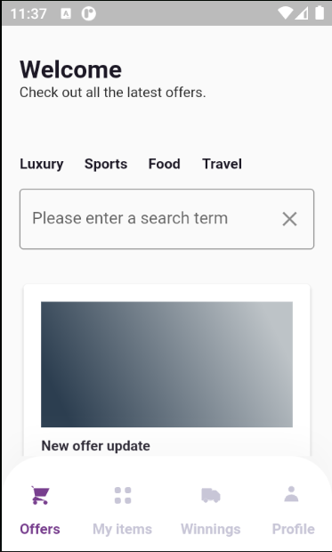
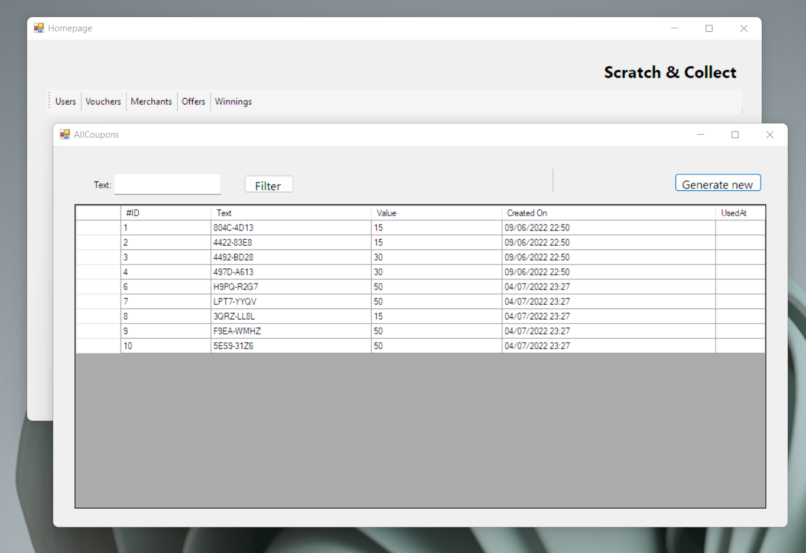

# Scratch & Collect

## Running the app
1. Clone the repo;
2. `cd` into the cloned folder;
3. Make sure API is running;
4. Run Mobile APP;

### API
- `cd` into the cloned repo;
- run `docker-compose build` to build the image;
- run `docker-compose up` to run the API container;
> NOTE: If you want to visit URL locally: `http://localhost:5010/swagger/index.html`

### Mobile
- `cd` into the cloned repo;
- `cd` into the `scratch-collect.Mobile` directory;
- run `flutter run` inside the directory or open via Android studio;
> NOTE: Make sure to run Android emulator before running the flutter command.

> NOTE: Min SDK version for the emulator has to be 18. Secure storage uses this SDK in order to store sensitive data on Android.

> NOTE: Tested on local Android emulator with API 32.

### Desktop
- Open the solution inside Visual Studio 2019 or 2022;
- Choose `scratch-collect.Desktop` in the toolbar / startup project;
- Hit the play button in order to run windows forms app;

## Credentials

### Mobile
- username: mobile@test.com
- password: test

### Desktop
- username: desktop@test.com
- password: test

## Payment card details
- card number : 5454545454545454
- month: 01
- year: 22
- cvv: 333

## Screenshots
-

>INFO: [More screenshots](scratch-collect.Documentation/screenshots)